# MIDI Cable Replacement Enclosure

## Introduction

This 3D design presents a custom housing tailored for an [MIDI Cable Replacement](https://github.com/SiliconLabsSoftware/open-pcb-prototypes/tree/main/midi_cable_replacement_board) module previously published. It is optimized for prototyping, testing, and DIY use, providing an easy-to-print structure that securely holds the internal components. The design ensures proper alignment, user-friendly interaction, and mechanical stability, making it ideal for hands-on experimentation and functional demonstrations.

## Prerequisites

### Hardware

- 3D printer
- BRD4318A
- MIDI Cable Replacement board
- 4 x M2.6-12mm Pan Head Self Tapping Screws (Bolt Head Style: Pan head, Diameter: 2.6mm, Bolt Length: 12mm)

|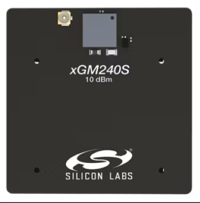|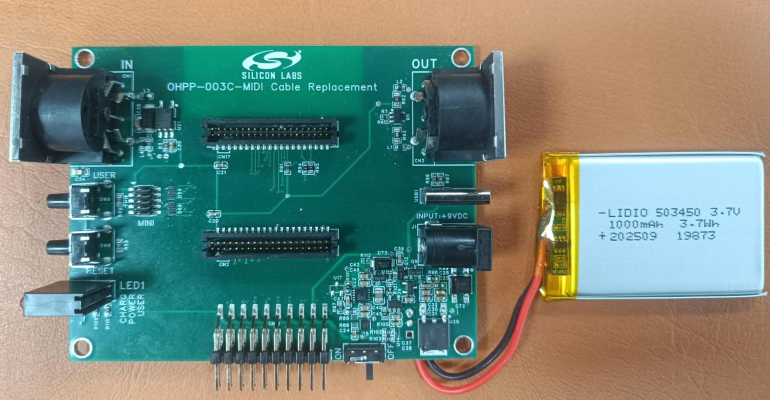|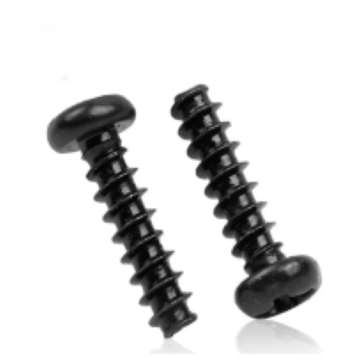|
|   :---      |   :---:    |    :---:     |
|BRD4318A | MIDI Cable Replacement board | M2.6 screw|

__Note__: We use PLA+ filament to print the case

### Software

- Fusion from Autodesk if you want to make updates based on provided design
- Slicer software (Bambu Studio for Bambu Lab printers)

## What’s Included in the Project

### Design

[MIDI Cable Replacement Design](MIDI_Cable_Replacement.f3z)
We provide a design file named [MIDI Cable Replacement](MIDI_Cable_Replacement.f3z) that you can open and edit using Fusion software.

|    Part       |    Design     |
|   :---:       |   :---:       |
| TOP part      | 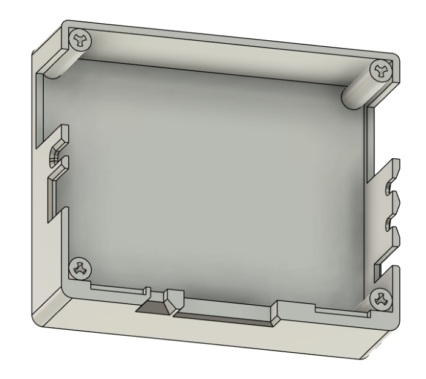 |
| Bottom part   | 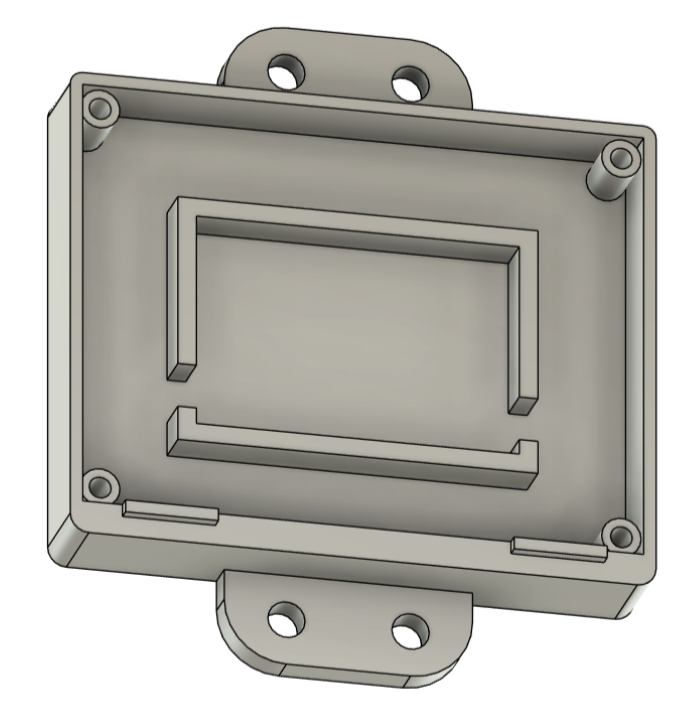 |
| Case          | 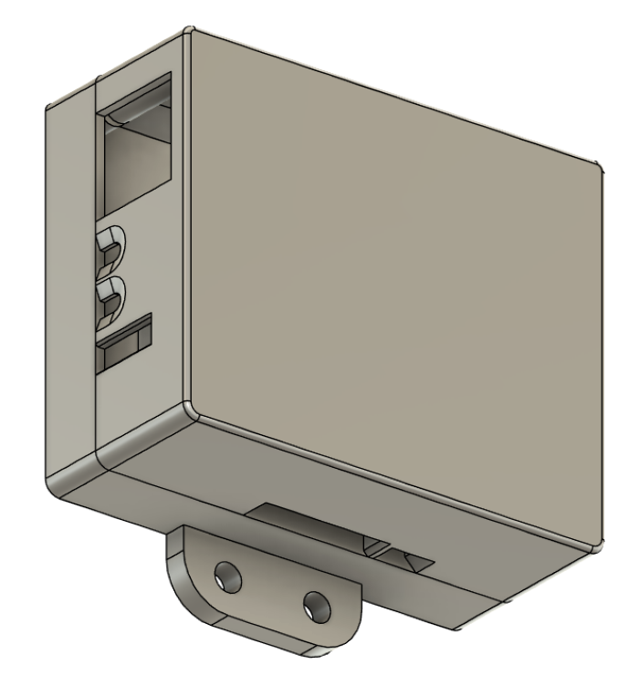|

### Print file

We provide a print file named [MIDI Cable Replacement](MIDI_Cable_Replacement.f3z.3mf), which is in 3D Manufacturing Format (3MF). This file can be opened in any slicer software that supports the 3MF format, including Bambu Studio, where you can view the model, prepare it for printing, and slice it to generate the necessary print instructions for your printer.

> [!NOTE]  
>We are using Bambu Studio and  Bambu Lab A1 printer with Bambu Lab PLA+ filament to print the provided 3D models for this example. \
The disclosed print parameters are tested only with this 3D printer. Fine tuning may be required if you have a different printer or filament.

|    Setting | Configuration |    Note       |
|   :---     | :---:         |    :---       |
|Nozzle temperature| 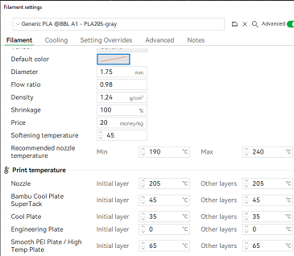 ||
|A1 bambu printer settings| 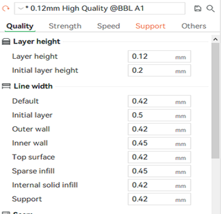 |We use 0.12mm High Quality @BBL A1 printing parameters |
|Support| 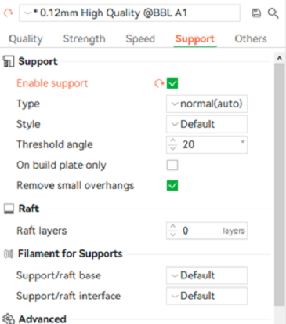 |Creating support is quite important, we create it automatically on Bambu Studio software.|

### STL files

In addition to the `.3mf` file, `.stl` files are also provided for compatibility.

- [Bottom_Part.stl](Bottom_Part.stl)
- [Top_Part.stl](Top_Part.stl)

## Installation Guide

Follow below steps to assemble all the parts.

|   Steps       |             |     Note      |
|   :---:       |   :---:     |    :---       |
| Install the Battery on to the Bottom Part | 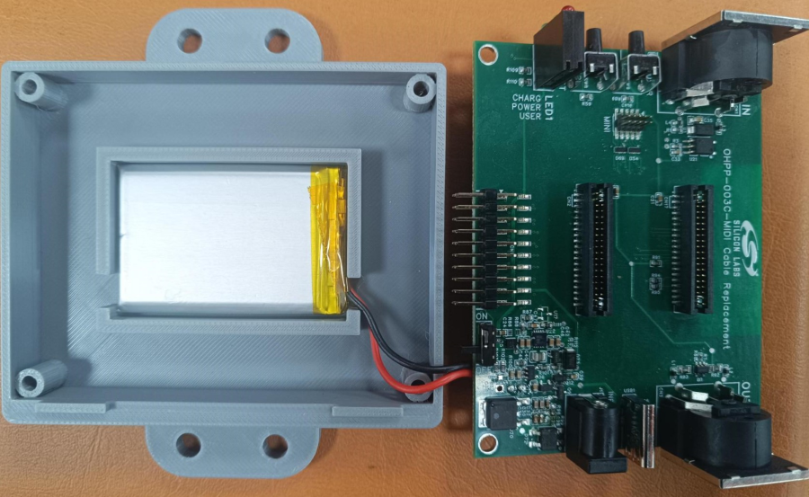 | Ensure the battery fit with Bottom part |
|MIDI cable replacement PCBA Installation| 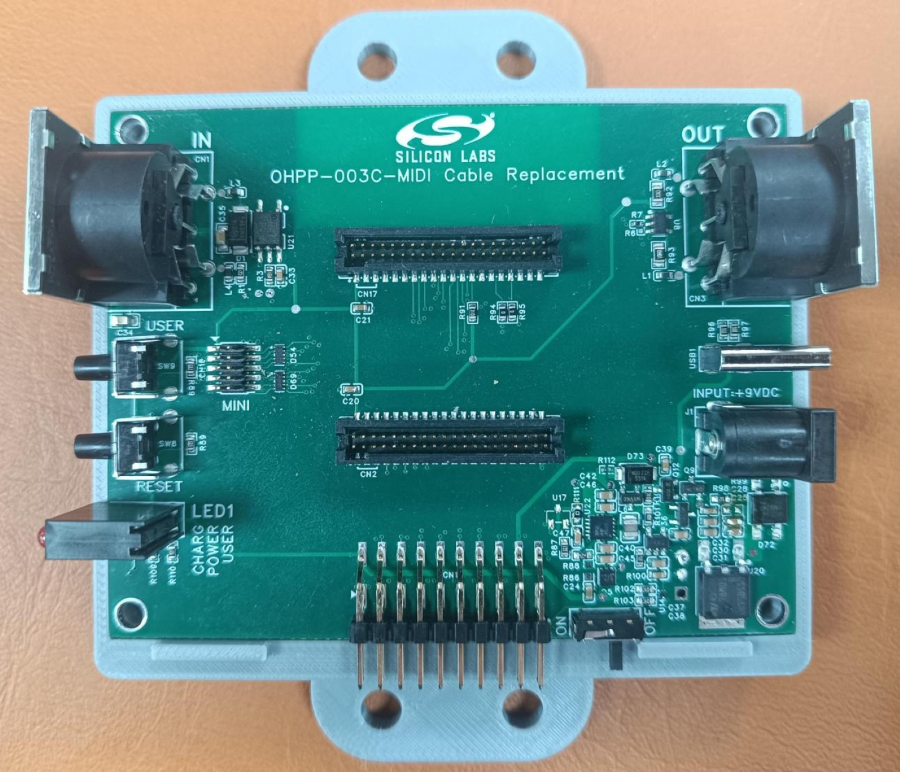| Pay attention to the direction of the PCBA|
| Top Part Installation | 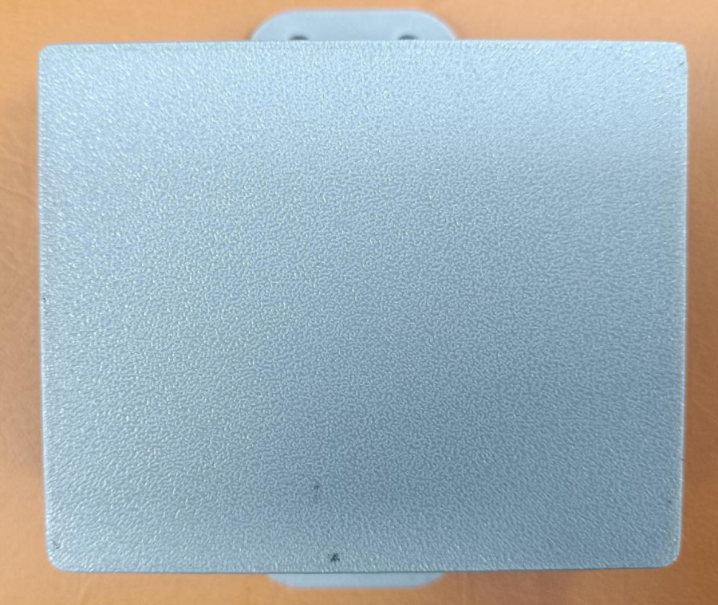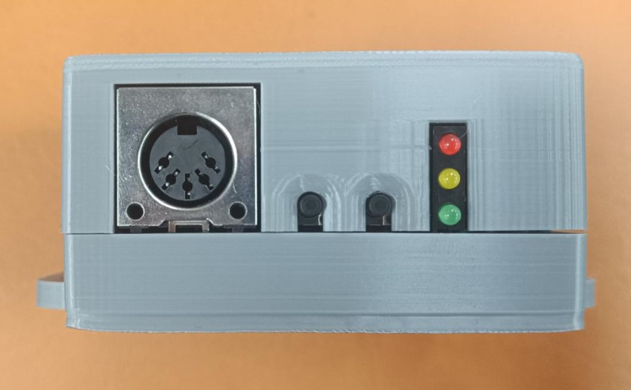 | Pay attention to the direction of the Top part. |
| M2.6 screw installation | 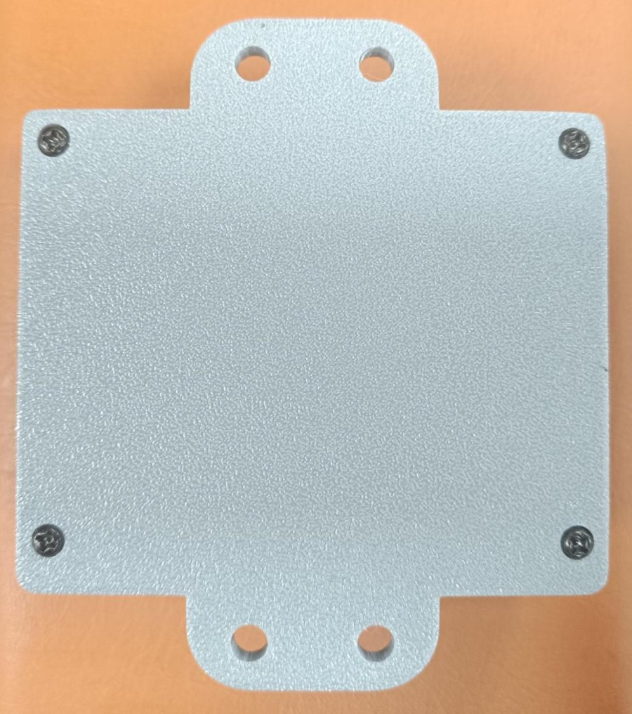 |  |
