# Energy Harvesting Wall Switch

## Introduction

This 3D design presents a custom wall switch housing tailored for an [Energy Harvesting Kinetic Switch](https://github.com/SiliconLabsSoftware/energy_harvesting_applications_staging/tree/main/example/bt_rail_soc_energy_harvesting_kinetic_switch) module previously published. It is optimized for prototyping, testing, and DIY use, providing an easy-to-print structure that securely holds the internal components. The design ensures proper alignment, user-friendly interaction, and mechanical stability, making it ideal for hands-on experimentation and functional demonstrations.

## Prerequisites

### Hardwares

- 3D printer
- xG22-EK8200A EFR32xG22E Energy Harvesting Explorer Kit
  - 1x BRD2710A - EFR32xG22E Explorer Board
  - 1x BRD8202A - Kinetic Button Shield, with e-peas PMIC AEM00300
- 1 x Wall holder
- 2 x M3-25mm Pan head SS 304 Screw  (Bolt Head Style: Pan, Head  Diameter: 3mm, Bolt Length: 25mm)
- 4 x M2.6-12mm Pan Head Self Tapping Screws (Bolt Head Style: Pan head, Diameter: 2.6mm, Bolt Length: 12mm)

|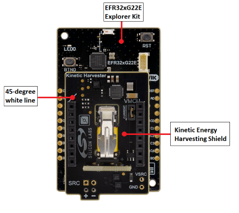|| ||
|   :---      |   :---:       |    :---:     |    :---:     |
|EFR32xG22E Energy Harvesting Kinetic switch |   Wall holder    | M3 screw | M2.6 screw|

__Note__: We use PLA+ filament to print the switch

### Software

- Fusion from Autodesk if you want to make updates based on provided design
- Slicer software (Bambu Studio for Bambu Lab printers)

## What’s Included in the Project

### Design

We provide a design file named [Wall_Switch_Energy_Harvesting_Kinetic.f3z](Wall_Switch_Energy_Harvesting_Kinetic.f3z) that you can open and edit using Fusion software.

|    Part       |    Design     |
|   :---:       |   :---:       |
| TOP part      | 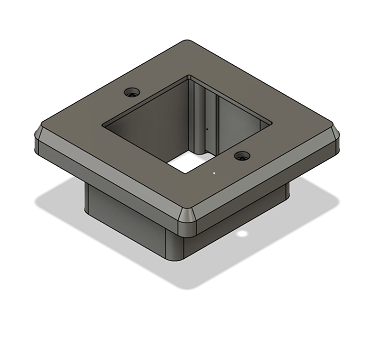 |
| Bottom part   | 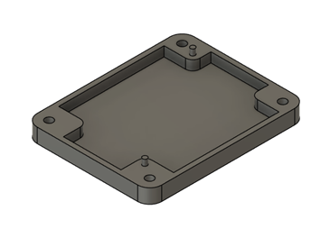 |
| Button part   | 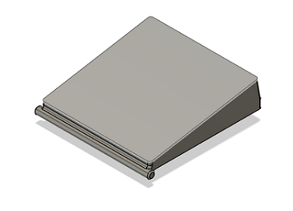 |
| Case          | 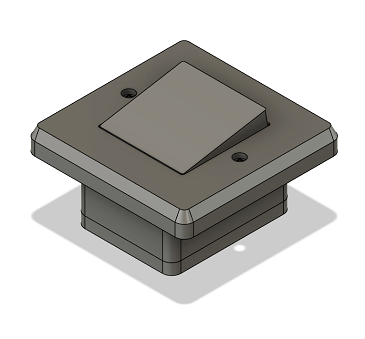|

### Print file

We provide a print file named [Wall_Switch_Energy_Harvesting_Kinetic_Bambu.3mf](Wall_Switch_Energy_Harvesting_Kinetic_Bambu.3mf), which is in 3D Manufacturing Format (3MF). This file can be opened in any slicer software that supports the 3MF format, including Bambu Studio, where you can view the model, prepare it for printing, and slice it to generate the necessary print instructions for your printer.

> [!NOTE]  
>We are using Bambu Studio and  Bambu Lab A1 printer with Bambu Lab PLA+ filament to print the provided 3D models for this example. \
The disclosed print parameters are tested only with this 3D printer. Fine tuning may required if you have a different printer or filament.

|    Setting | Configuration |    Note       |
|   :---     | :---:         |    :---       |
|Nozzle temperature| 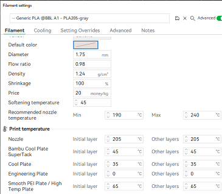 ||
|A1 bambu printer settings| 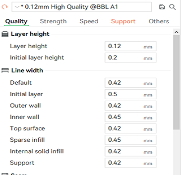 |We use 0.12mm High Quality @BBL A1 printing parameters |
|Support| 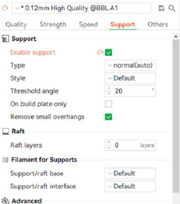 |Creating support is quite important, we create it automatically on Bambu Studio software.|

### STL files

In addition to the `.3mf` file, `.stl` files also provided for compatibility.

- [Bottom_Part.stl](Bottom_Part.stl)
- [Top_Part.stl](Top_Part.stl)
- [Button_Part.stl](Button_Part.stl)

## Installation Guide

Follow below steps to assemble all the parts.

|   Steps       |             |     Note      |
|   :---:       |   :---:     |    :---       |
| Button and Top Installation | 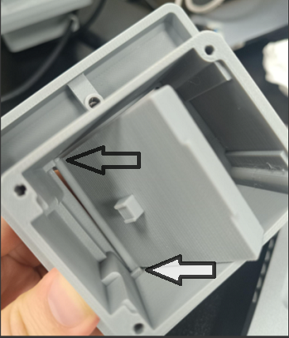 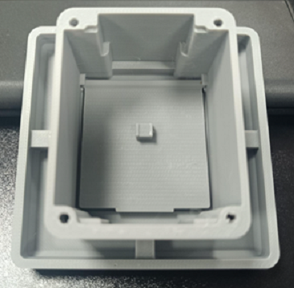   | (1) Ensure the protruding part of the button is fully inserted into the holder, aligning it with the direction indicated by the arrow.   (2) Firmly press the remaining part into the holder. Expect some resistance, as it may require extra force to secure it properly.|
|EFR32xG22E Energy Harvesting Explorer Kit Installation| 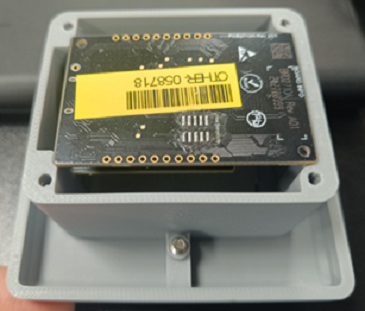| Pay attention to the direction of the PCBA|
| Bottom Installation | 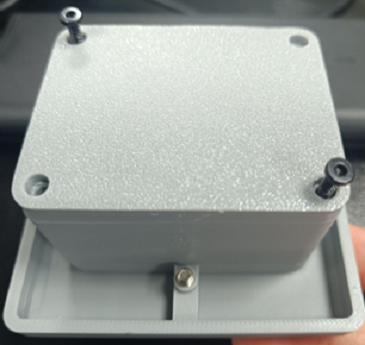 | Pay attention to the direction of the Bottom part. |
| Wall Mounted | 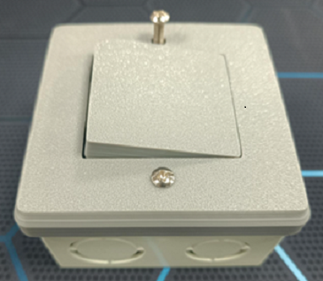 | Mounting the case to the holder allows us to mount the case on the wall, it acts like a button |

## Testing with Energy Harvesting Kinetic Switch

- Follow [Energy Harvesting Kinetic Switch](https://github.com/SiliconLabsSoftware/energy_harvesting_applications_staging/tree/main/example/bt_rail_soc_energy_harvesting_kinetic_switch) to setup Energy Harvesting Kinetic Switch module.

- Follow [Installation Guide](#installation-guide) to assemble it all together

- Check out result

  
